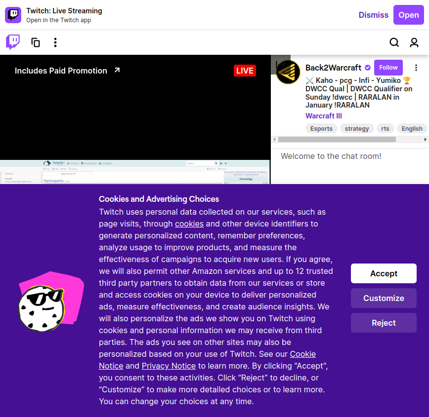

# Twitch Search Test Framework

This is a small test framework using **pytest** and **Selenium** to automate searching for a streamer on the Twitch mobile site, taking a screenshot after navigating to a specific streamer’s page. The test performs the following steps:



1. Opens the Twitch mobile site.
2. Clicks the search icon and searches for "StarCraft II".
3. Scrolls down twice to load more streamers.
4. Selects the first available streamer.
5. Waits for the streamer’s page to load completely, then takes a screenshot.

## Prerequisites

- **Python 3.7+**
- **Google Chrome** browser
- **ChromeDriver** (managed automatically with `webdriver-manager`)

## Installation

1. Clone this repository and navigate to the project directory.

   ```bash
   git clone <repository-url>
   cd twitch_tests

2. Install the required Python packages using requirements.txt.

```bash

pip install -r requirements.txt


## Project sctructure


twitch_tests/
├── tests/
│   └── test_twitch.py     # The main test file
├── conftest.py             # Pytest configuration and Selenium driver setup
└── requirements.txt        # Dependencies for the project
└── README.md               # Project documentation


Usage

    Run the tests using pytest:

    bash

    pytest tests/

    After running the test, a screenshot named streamer_page_screenshot.png will be saved in the project directory, showing the loaded page of the selected streamer.

Additional Configuration

The default WebDriver configuration in conftest.py is set to run Chrome in headless mode with a fixed window size. You can modify these settings in conftest.py if you need to run tests with a visible browser.
Notes

    Screenshot: The screenshot is taken at the end of the test and will be saved in the project root folder.

Troubleshooting

If you encounter any issues, ensure the following:

    You have a stable internet connection (the test interacts with an online site).
    ChromeDriver is compatible with your Chrome version. If issues persist, try updating Chrome and reinstalling ChromeDriver.